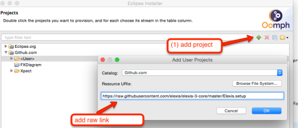
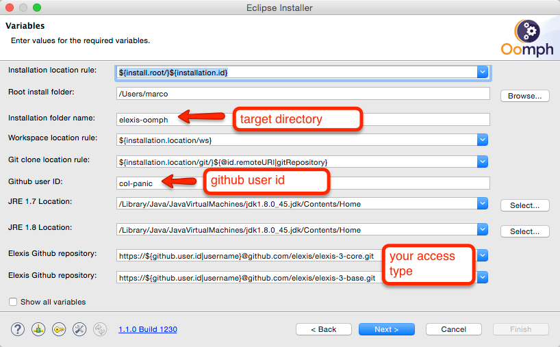
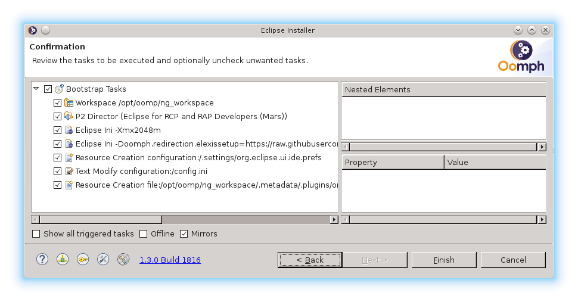

# Elexis SDK

*MEDEVIT \<office@medevit.at\>* Last update: 12.10.2022

This project is used to automatically set-up an Elexis 3 development
environment using the [Eclipse Oomph
Installer](http://wiki.eclipse.org/Eclipse_Oomph_Installer). It
integrates both core, base and [Medelexis](http://www.medelexis.ch)
resources. This project is not used outside of the Oomph installer tool.

This documentation was verified with Oomph v1.27.0 Build 5664 (with an
embedded JRE) and used the “Eclipse IDE for RCP and RAP Developers -
2022-09”. The setup file referenced in this document is located in the
root of this git repository (that is `../Elexis.setup` )

## Usage

Eclipse Oomph is a toolkit to realize automated installations of project
specific Eclipse installations. It is hence used to set-up Eclipse for a
specific project. In order to employ Oomph to setup an Elexis
development environment we proceed as follows:

1.  Download Oomph specific to your system from
    <https://wiki.eclipse.org/Eclipse_Installer> 
2.  Start Oomph (eclipse installer) and switch to the *Advanced* wizard
       
3.  In the advanced wizard select *Eclipse for RCP and RAP developers*
    as `Product` and select **Next\>** 
4.  Now you see the list of `Projects`, here you have to add the setup
    file for Elexis. Save the link
    <https://raw.githubusercontent.com/elexis/elexis-3-core/master/Elexis.setup>
    . e.g as /tmp/Elexis.setup. Add it as follows  
      
    With OOMP 1.3.0 the https-URL did not work and you must add the
    Elexis.setup via the File system.
5.  Now you add the required Elexis parts to your installation setup.
    There exist four different parts
    1.  `Elexis` (
        [elexis-3-core](https://github.com/elexis/elexis-3-core/) and
        [elexis-3-base](https://github.com/elexis/elexis-3-base/) ) -
        contains the base open source elexis, a github account is
        required
    2.  `Medelexis` - the Medelexis plugins part, only accessible to
        users who have access to the Medelexis repo
    3.  `Medelexis Application` - the core Medelexis application, only
        accessible to core Medelexis developers
    4.  `Austria` (
        [elexis-3-austria](https://github.com/elexis/elexis-3-austria) )
        - setup for plugins specific to Austrian requirements , requires
        github account
6.  for a default open source development environment in the master
    stream select the projects as follows  
     and press **Next\>**. 
7.  the first time you use the installer you have to provide some
    additional information. Select “Show all variables” and please be
    careful to select the correct github username and/or access type,
    otherwise the installationw will fail.  
    
8.  You have to select the installation folder name, use `elexis` or
    whatever fits you. Here you will finally find your pre-configured
    development environment for Elexis open source.
9.  Pressing **Next\>** again you can verify the tasks being executed
     and start the installation with
    **Finish**. This will take a while.
10. After the basic product installation was done, the newly installed
    Eclipse IDE is started and the setup tasks are executed (source
    checkout, IDE configuration etc.).
11. If you some of your variables were wrong (e.g. wrong path for a Java
    JDK). The setup will not complete and you must correct the choices,
    via “Help..Performe Setup Tasks”. There press **Back\>** to be able
    to review the variables.
12. Right click on ch.elexis.target/elexis.tpd and select “Set as Target
    Platform”, wait for “Resolving Target Definition” to finish,
13. Rebuild everything via the menu Project..Clean
14. If a window “Errors in Workspace” pops up, ignore or correct the
    errors.
15. ensure that you have as default java a Java-8 version or compiling
    via maven will fail. Check it using `mvn -version`
16. You must run first on the command-line `mvn -V clean verify
    -DskipTests` to guild the needed directories src-gen in
    ch.elexis.core.jpa.entities, etc.
17. Double-click on `ch.elexis.core.p2site/Elexis.product`. Click the
    “Launch an Eclipse application in Debug mode”. Ignore the warning
    and you should get a dialog to select a database for elexis.
18. If you want to restart debugging, then open the menu “Run..Debug
    Configuration” and select in the left selection pane the “Eclipse
    application/Elexis.product” item. Adapt the arguments etc to suit
    your needs [Startoptionen](https://wiki.elexis.info/Startoptionen)
    contains hints for commonly used option
    
19. Press Debug to launch a very minimal Elexis.
20. Ignore warnings in the pop-up windows for
    `org.osgi.framework.system.packages.extra` and `commons-logging`,
    `woodstox-core-asl`
21. Open `Run..Debug Configurations..` Copy Elexis.product and give it a
    name. If you set in the `Arguments` tab `VM Arguments` to

<!-- end list -->

    -Duser.language=de -Duser.region=CH -Dfile.encoding=utf-8
    -Dch.elexis.dbFlavor=h2 -Dch.elexis.dbSpec='jdbc:h2:~/h2_elexis_rcptt_de/db;AUTO_SERVER=TRUE'
    -Dch.elexis.dbUser=sa -Dch.elexis.dbPw=
    -Dch.elexis.firstMandantName=Mustermann -Dch.elexis.firstMandantPassword=elexisTest -Dch.elexis.firstMandantEmail=mmustermann@elexis.info
    -Dch.elexis.username=Mustermann -Dch.elexis.password=elexisTest

you will connect directly to a newly created h2-database.

## Troubleshooting

We have seen cases where parts of the setup could not be installed. I
might help if you

  - Fork the elexis-3-core and elexis-3-base projects in github before
    running the OOMP installer, or you will experience problems with the
    checkout
  - remove the BundlePool. Its name is shown near the bottom of the
    first screen after switching to the Advanced mode.
  - restart the installation.

If the problem persists, open a bug report or send a mail to elexis
[developer mailing list](elexis-develop@lists.sourceforge.net)
